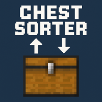

# Chest Sorter (Minecraft Bedrock Edition)

A powerful inventory-sorting behavior pack for Minecraft Bedrock 1.21.90+.  
Sneak + click any container (chest, barrel, etc.) to instantly alphabetize and stack its contents — no cheats required!

---

## 📦 Features

- ✅ Works in **singleplayer**, **multiplayer**, and **dedicated server (BDS)**
- ✅ **Stacks up to each item’s actual max stack size**
- ✅ **Alphabetical sorting** by item type ID
- ✅ **Safe rollback** if any item gets lost
- ✅ Fully written in JavaScript using `@minecraft/server` v2.0.0
- ✅ Supports all vanilla containers with inventories

---

## 🛠️ How It Works

- Sneak + interact with a container
- The mod:
  - ~~Cancels the default GUI~~
  - Clones and tallies all items
  - Merges and stacks by item ID and damage
  - Sorts alphabetically
  - Writes the result back the next tick
  - Verifies **total item count matches** original
  - If mismatch, reverts and logs the issue in chat
  - Opens the sorted chest

---

## 🔧 Installation

1. Enable **Script API** and **Beta APIs** (optional) in your world settings.
2. Drop this behavior pack into your `behavior_packs` folder.
3. In the world folder, add the behavior pack to `world_behavior_packs.json`.
4. Load the world and enjoy streamlined storage.

> Cheats are **not required** — all features work in survival without command use.

---

## 📁 File Structure

📦 chest-sorter/
├── manifest.json
├── pack_icon.png
└── scripts/
└── main.js

---

## 🧪 Tested On

- Minecraft Bedrock 1.21.90+
- Windows 10/11, Dedicated Server (BDS)
- Singleplayer + local multiplayer

---

## 📜 License

MIT License — use, modify, and share freely. Attribution appreciated!

---

## 💡 Idea by

@p99will — Minecraft tooling for builders, modders, and pack-makers.
